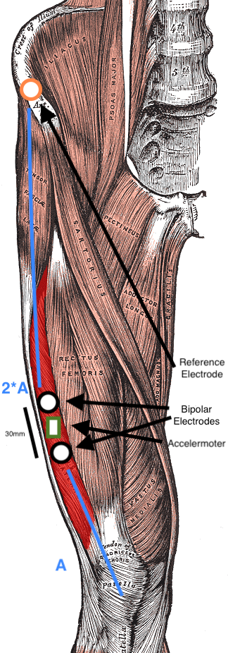

<link href="https://fonts.googleapis.com/css2?family=Maven+Pro:wght@400..900&display=swap" rel="stylesheet">

# Study Protocol
Last edited: June 12th, 2024

## Variables to be Collected
- Muscle Data [2x per day - one time in the morning after waking up, one time in the evening]
   - EMG measurements
   - MMG measurements
- Survey data [1x per day - in the evening]
- Step count [1x per day - in the evening]

### Muscle Data Measurement Protocol

1. Clean skin where the electrodes will be positioned
2. Position measurement electrodes as in [Smith et al 2017](https://doi.org/10.1002/mus.25502) - see drawing

3. Start protocol time tracker
4. Sit down on the floor, against a wall, legs straight
5. Keep muscles relaxed, start measurement (10s)
6. Try to maximally contract your upper leg muscles as much as possible for 3 x  6s (see also [Hendrix et al (2009)](https://www.sciencedirect.com/science/article/pii/S0165027009002015))
7. Stand up and take wall sit position, 90 degree angle (30s) (this is a form of isometric muscle contraction and according to [Li et al. 2024](https://doi.org/10.1145/3648679), this is the type of exercise most often used in fatigure detection based on EMG; also wall sit is an [exercise that engages the vastus lateralis](https://www.yourhousefitness.com/blog/exercise-tutorial-wall-sit#google_vignette); similarly [Gawda et al 2018](https://www.aaem.pl/pdf-81716-26429?filename=Differences%20in.pdf) ask runners to perform 60s squats to measure fatigue)
8. Sit down again, back agains the wall, legs straight (10s)

### Survey
#### Assesssing Fatigue
We are using an adapted version of the Checklist Individual Strength (CIS) for our questionnaire. This instrument was originally developed for measuring severity of fatigue in hospital studies of chronic fatigue symptom patients but has also been validated in the working population (see [Beurskens et al., 2000](https://oem.bmj.com/content/oemed/57/5/353.full.pdf)). Many other fatigue measurement scales such as e.g. the Fatigue Severity Scale (FSS) ([Krupp et al., 1989](10.1001/archneur.1989.00520460115022)) or the Fatigue Impact Scale (FIS)([Fisk et al 1994](https://pubmed.ncbi.nlm.nih.gov/8148458/)) have either not been validated in healthy individuals or presume the ongoing presence of fatigue and are thus not applicable to our use case. Additionally, the CIS has been proven to have a good internal consistency and has been shown to be sensitive to change in fatigue levels over time (see [Dittner et al. 2004](https://www.sciencedirect.com/science/article/pii/S0022399903003714)).

However,  in its original form the CIS is intended to assess fatigue levels over  time periods of 2 weeks ([Beurskens et al., 2000](https://oem.bmj.com/content/oemed/57/5/353.full.pdf)), we thus adapt the statements to be applicable to the past day as the questionnaire is inteded to be filled out at the end of each day.

The survey has 20 items that are scored on a 7 level agreement scale ranging from 1="yes, thats true" to "7=no, thats not true"

- I felt tired
- I felt very active
- Thinking required effort
- Physically I felt exhausted
- I felt like doing all kinds of nice things
- I felt fit
- I did quite a lot today
- When I have been doing something, I was able to concentrate very well
- I felt weak
- I didn't do much during the day
- I could concentrate well
- I felt rested
- I had trouble concentrating
- Physically I felt I am in a bad condition
- I am full of plans
- I got tired very quickly
- I had a low output
- I felt no desire to do anything
- My thoughts easily wandered
- Physically I felt in a good shape

#### Assessing overall wellbeing and muscle soreness
Since our study specifically focuses on muscle fatigue, we incorporated additional items in the questionnaire to better represent this specific dimension as it is not explicitly covered in the CIS. For this we adapted the [Hooper Index](https://pubmed.ncbi.nlm.nih.gov/7898325/) which is regularly used for the assessment of wellbeing in sports studies (e.g. [Clemente et al 2017](https://www.sciencedirect.com/science/article/pii/S003193841631068X?via%3Dihub#bb0110), [Clemente et al 2019](https://www.ncbi.nlm.nih.gov/pmc/articles/PMC6714361/#j_hukin-2019-0002_ref_011), [Haddad et al 2013](https://www.sciencedirect.com/science/article/pii/S0031938413002023))
Additional items to focus on muscles:
- Sleep Quality
   - very, very good
   - very good
   - good
   - average
   - bad
   - very bad
   - very, very bad
- Stress Level
   - very, very good
   - very good
   - good
   - average
   - bad
   - very bad
   - very, very bad
- Fatigue Level
  - very, very good
   - very good
   - good
   - average
   - bad
   - very bad
   - very, very bad
- Muscle Soreness
   - very, very low
   - very low
   - low
   - average
   - high
   - very high
   - very, very high

### Additional Questions

To be able to account for potential confounders, taking into consideration other studies on wellbeing, we further record the following measures:
Closed form: 
- How many hours did you sleep last night? - Numeric
- How many coffees have you had today? - Numeric
- Day in menstruation cycle - Numeric
- Alcohol consumption
   - no alcohol
   - one light alcoholic drink (e.g. beer, wine)
   - two light alcoholic drinks or one strong alcoholic drink (e.g. cocktail, shot)
   - more than three alcoholic drinks
- What physical activities did you engage in today?
   - Walking for 30min or longer
   - Yoga
   - Weight Lifting
   - High Intensive Interval Training
   - Running
   - Ball Sports
   - Cycling for 30min or longer
   - Swimming
   - Other: please specify
- Pedometer - Numeric
Free text:
- Did you have any illnesses recently?
- Was there anything that stressed you today?
- Short, keyword description of what you did today
- Any comments regarding the measurement session today (e.g. bloopers with electrodes etc.)
- Was there anything else that might be relevant?

<!--
#### Questions from first trial
- How fatigued were your muscles today? 1 (no fatigue at all) to 7 (extremely fatigued)
   - Level 1: No Fatigue at All: Muscles feel completely fresh, as if you haven't exercised or engaged in any physical activity.
      - No soreness or stiffness.
      - Full range of motion without discomfort.
      - Able to walk and climb stairs with ease and no perceived effort.
      - Able to perfrom all kiinds of common tasks without hinderance.
   - Level 2: Very Mild Fatigue: Muscles are slightly tired, but it’s barely noticeable.
      - Slight sense of tiredness.
      - No pain or soreness.
      - Full range of motion with minimal perceived effort.
   - Level 3: Mild Fatigue: Muscles are tired but still function normally without any significant discomfort.
      - Noticeable but mild tiredness.
      - Minor stiffness or tightness.
      - Able to perform most physical tasks, though with slightly increased effort.
   - Level 4: Moderate Fatigue: Muscles feel tired, and there is a noticeable decrease in performance.
      - Tiredness and some soreness.
      - Reduced strength and endurance.
      - Slight discomfort during movement, but tasks are still manageable.
   - Level 5: Significant Fatigue: Muscles are quite tired, and performing physical tasks is more challenging.
      - Moderate soreness and stiffness.
      - Noticeable drop in strength and endurance.
      - Movement involves a fair amount of effort, and some tasks might be difficult.
   - Level 6: Severe Fatigue: Muscles are very tired, with significant discomfort and reduced ability to perform tasks.
   - Severe soreness and stiffness.
   - Major decrease in strength and endurance.
   - Performing physical tasks is very challenging and uncomfortable.
   - Level 7: Extremely Fatigued: Muscles are exhausted to the point where performing any physical activity is almost impossible.
   - Intense soreness and stiffness.
   - Extremely low strength and endurance.
   - Any movement causes significant discomfort, and even simple tasks are barely achievable.

- Symptoms experienced today 
   - Muscle weakness
   - Trouble climbing stairs
   - Trouble standing from a seated position
   - Active Rash
   - Brain Fog
   - Extreme Fatigue
- How difficult was it to dress and shower today? 1 (no difficulty) to 5 (unable to do).
- How difficult was it to climb stairs today? 1 (no difficulty) to 5 (unable to do).
- How difficult was it to complete common daily activities?  1 (no difficulty) to 5 (unable to do). [Kick Out - high correlation with pain] 
- How much pain were you in today? 1 (pain at all) to 5 (worst pain experienced).
- Do you have an active and visible rash? 1 (no rash at all) to 5 (very visible rash in DM areas)
- Overall how did you feel today? As an overall "wellness" 1 (horrible, hard to function) to 5 (very well).[Kick Out - high correlation with pain]
- How do you think you will feel tomorrow? As an overall "wellness" 1 (horrible, hard to function) to 5 (very well).

### References
-->
<!---
- Beurskens AJHM, Bültmann U, Kant I, et alFatigue among working people: validity of a questionnaire measureOccupational and Environmental Medicine 2000;57:353-357.
[https://oem.bmj.com/content/oemed/57/5/353.full.pdf](https://oem.bmj.com/content/oemed/57/5/353.full.pdf)
- A.J Dittner, S.C Wessely, R.G Brown, The assessment of fatigue: A practical guide for clinicians and researchers Journal of Psychosomatic Research, Volume 56, Issue 2, 2004, Pages 157-170, ISSN 0022-3999, [https://doi.org/10.1016/S0022-3999(03)00371-4.](https://www.sciencedirect.com/science/article/pii/S0022399903003714)
- Fisk JD, Ritvo PG, Ross L, Haase DA, Marrie TJ, Schlech WF.
Measuring the functional impact of fatigue: initial validation of
the fatigue impact scale. Clin Infect Dis 1994;18(Suppl 1):
S79 – 83. (https://pubmed.ncbi.nlm.nih.gov/8148458/)[https://pubmed.ncbi.nlm.nih.gov/8148458/]
- Hendrix C. Russell , Housh Terry J. , Johnson Glen O. ,  Mielke Michelle, Camic Clayton L. , Zuniga Jorge M. , Schmidt  Richard J., A new EMG frequency-based fatigue threshold test, Journal of Neuroscience Methods, Volume 181, Issue 1, 2009, Pages 45-51, ISSN 0165-0270, [https://doi.org/10.1016/j.jneumeth.2009.04.011.](https://www.sciencedirect.com/science/article/pii/S0165027009002015)
- Gawda P, Ginszt M, Ginszt A, Pawlak H, Majcher P. Differences in myoelectric manifestations of fatigue during isometric muscle actions. Ann Agric Environ Med. 2018 Jun 20;25(2):296-299. doi: [10.26444/aaem/81716.](10.26444/aaem/81716) Epub 2018 Feb 21. PMID: 29936808.
- Hooper SL, Mackinnon LT, Howard A, Gordon RD, Bachmann AW. Markers for monitoring overtraining and recovery. Med Sci Sports Exerc. 1995 Jan;27(1):106-12. PMID: 7898325. [https://pubmed.ncbi.nlm.nih.gov/7898325/](https://pubmed.ncbi.nlm.nih.gov/7898325/)
-  Krupp LB, LaRocca NG, Muir-Nash J, Steinberg AD. The
Fatigue Severity Scale. Application to patients with multiple
sclerosis and systemic lupus erythematosus. Arch Neurol 1989;
46:1121 – 3. doi: [10.1001/archneur.1989.00520460115022.](10.1001/archneur.1989.00520460115022.)

- Na Li, Rui Zhou, Bharath Krishna, Ashirbad Pradhan, Hyowon Lee, Jiayuan He, and Ning Jiang. 2024. Non-invasive Techniques for Muscle Fatigue Monitoring: A Comprehensive Survey. ACM Comput. Surv. 56, 9, Article 221 (September 2024), 40 pages. [https://doi.org/10.1145/3648679](https://doi.org/10.1145/3648679)

- Smith, C.M., Housh, T.J., Hill, E.C., Johnson, G.O. and Schmidt, R.J. (2017), Changes in electromechanical delay during fatiguing dynamic muscle actions. Muscle Nerve, 56: 315-320. [https://doi.org/10.1002/mus.25502](https://doi.org/10.1002/mus.25502)

- Miura N, Watanabe T. Potential of M-Wave Elicited by Double Pulse for Muscle Fatigue Evaluation in Intermittent Muscle Activation by Functional Electrical Stimulation for Motor Rehabilitation. J Med Eng. 2016;2016:6957287. doi: 10.1155/2016/6957287. Epub 2016 Mar 27. PMID: 27110556; PMCID: PMC4826699.
- Sengchuai K, Kanjanaroat C, Jaruenpunyasak J, Limsakul C, Tayati W, Booranawong A, Jindapetch N. Development of a Real-Time Knee Extension Monitoring and Rehabilitation System: Range of Motion and Surface EMG Measurement and Evaluation. Healthcare (Basel). 2022 Dec 15;10(12):2544. doi: [10.3390/healthcare10122544](10.3390/healthcare10122544). PMID: 36554067; PMCID: PMC9778223.

- Hodges PW, van den Hoorn W, Wrigley TV, Hinman RS, Bowles KA, Cicuttini F, Wang Y, Bennell K. Increased duration of co-contraction of medial knee muscles is associated with greater progression of knee osteoarthritis. Man Ther. 2016 Feb;21:151-8. doi: [10.1016/j.math.2015.07.004.](10.1016/j.math.2015.07.004.) Epub 2015 Jul 17. PMID: 26254263.--->

