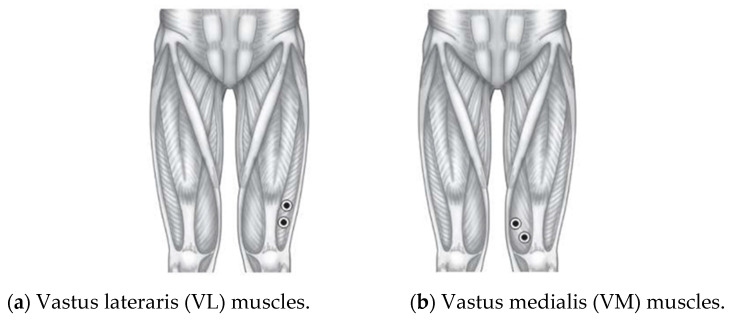

<link href="https://fonts.googleapis.com/css2?family=Maven+Pro:wght@400..900&display=swap" rel="stylesheet">

# Study Protocol
Last edited: June 11th, 2024

## Variables to be Collected
- Muscle Data
   - EMG measurements
   - MMG measurements
- Survey data
- Step count

### Muscle Data Measurement

Timing? -> in the morning?! (most consistent?)

### EMG Measurement Protocol

1. Clean skin where the electrodes will be positioned
2. Position measurement electrodes (E1 & E2) as in [Sengchuai et al (2022)](10.3390/healthcare10122544) - around 8cm above the knee, area of greatest muscle bulk (see also [Hodges et al 2015](https://www.mskscienceandpractice.com/article/S1356-689X%2815%2900143-5/pdf), similarly [Miura et al 2016](10.1155/2016/6957287))

3. Position reference electrode (E0) on the knee
4. Start protocol time tracker
5. Sit down on the floor, against a wall, legs straight
6. Keep muscles relaxed, start measurement (10s)
7. Try to maximally contract your upper limb muscles as much as possible for 3 x  6s (see also [Hendrix et al (2009)](https://www.sciencedirect.com/science/article/pii/S0165027009002015))
8. Stand up and take wall sit position, 90 degree angle (30s) (this is a form of isometric muscle contraction and according to [Li et al. 2024](https://doi.org/10.1145/3648679), this is the type of exercise most often used in fatigure detection based on EMG; also wall sit is an [exercise that engages the vastus lateralis](https://www.yourhousefitness.com/blog/exercise-tutorial-wall-sit#google_vignette); similarly [Gawda et al 2018](https://www.aaem.pl/pdf-81716-26429?filename=Differences%20in.pdf) ask runners to perform 60s squats to measure fatigue)
9. Sit down again, back agains the wall, legs straight (10s)

### References

- Hendrix C. Russell , Housh Terry J. , Johnson Glen O. ,  Mielke Michelle, Camic Clayton L. , Zuniga Jorge M. , Schmidt  Richard J., A new EMG frequency-based fatigue threshold test, Journal of Neuroscience Methods, Volume 181, Issue 1, 2009, Pages 45-51, ISSN 0165-0270, [https://doi.org/10.1016/j.jneumeth.2009.04.011.](https://www.sciencedirect.com/science/article/pii/S0165027009002015)
- Gawda P, Ginszt M, Ginszt A, Pawlak H, Majcher P. Differences in myoelectric manifestations of fatigue during isometric muscle actions. Ann Agric Environ Med. 2018 Jun 20;25(2):296-299. doi: [10.26444/aaem/81716.](10.26444/aaem/81716) Epub 2018 Feb 21. PMID: 29936808.
- Hodges PW, van den Hoorn W, Wrigley TV, Hinman RS, Bowles KA, Cicuttini F, Wang Y, Bennell K. Increased duration of co-contraction of medial knee muscles is associated with greater progression of knee osteoarthritis. Man Ther. 2016 Feb;21:151-8. doi: [10.1016/j.math.2015.07.004.](10.1016/j.math.2015.07.004.) Epub 2015 Jul 17. PMID: 26254263.
- Na Li, Rui Zhou, Bharath Krishna, Ashirbad Pradhan, Hyowon Lee, Jiayuan He, and Ning Jiang. 2024. Non-invasive Techniques for Muscle Fatigue Monitoring: A Comprehensive Survey. ACM Comput. Surv. 56, 9, Article 221 (September 2024), 40 pages. [https://doi.org/10.1145/3648679](https://doi.org/10.1145/3648679)
- Miura N, Watanabe T. Potential of M-Wave Elicited by Double Pulse for Muscle Fatigue Evaluation in Intermittent Muscle Activation by Functional Electrical Stimulation for Motor Rehabilitation. J Med Eng. 2016;2016:6957287. doi: 10.1155/2016/6957287. Epub 2016 Mar 27. PMID: 27110556; PMCID: PMC4826699.
- Sengchuai K, Kanjanaroat C, Jaruenpunyasak J, Limsakul C, Tayati W, Booranawong A, Jindapetch N. Development of a Real-Time Knee Extension Monitoring and Rehabilitation System: Range of Motion and Surface EMG Measurement and Evaluation. Healthcare (Basel). 2022 Dec 15;10(12):2544. doi: [10.3390/healthcare10122544](10.3390/healthcare10122544). PMID: 36554067; PMCID: PMC9778223.

